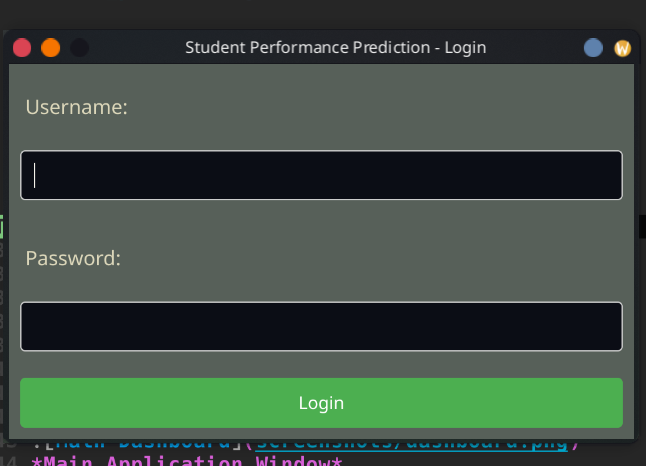
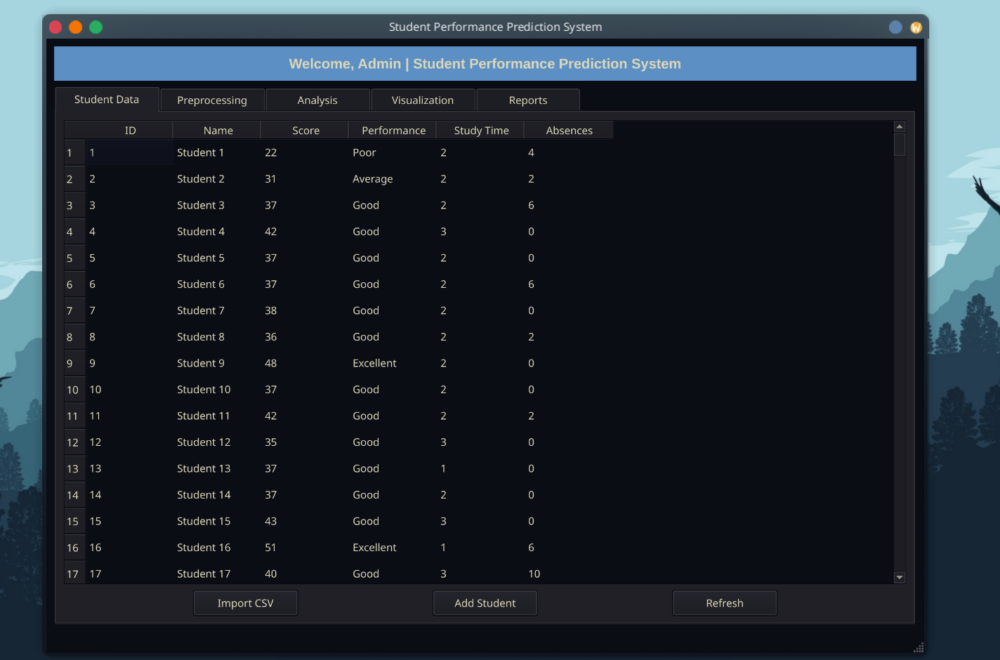

# Student Academic Performance Prediction System

A desktop application that predicts student academic performance using data mining techniques with Python, PyQt, and SQLite.

## Features

- **User Authentication**
  - Role-based login system (Admin/Faculty)
  - Secure password storage

- **Student Data Management**
  - Import from CSV (train.csv supported)
  - Add/Edit/Delete student records
  - View all student data in table format

- **Data Processing**
  - Handle missing values (drop, mean, median)
  - Data normalization (Min-Max, Standard scaling)

- **Performance Prediction**
  - Decision Tree classifier
  - Naive Bayes classifier
  - Accuracy reporting

- **Visualization**
  - Performance distribution charts
  - Score analysis by demographics
  - Interactive matplotlib graphs

- **Reporting**
  - Generate performance reports
  - Export to PDF/Excel/CSV

## Screenshots

*Login Interface*

🦍

*Main Application Window*

